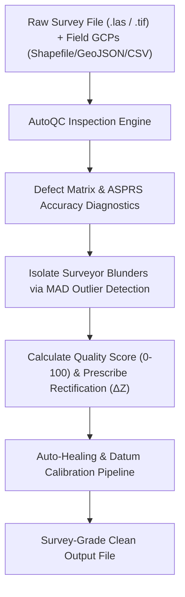

# AutoQC: Survey Diagnostics & Auto-Healing

The **AutoQC** engine (`dronegeo.autoqc`) serves as an automated quality inspector and healing pipeline for raw UAV surveys. It detects defects, evaluates Ground Control Points (GCPs) and independent Checkpoints against ASPRS/NSSDA specifications, explains root causes in plain language, and auto-heals files in one step.

---

## 1. What It Does

When drones capture LiDAR and photogrammetry data, common field issues arise that corrupt downstream deliverables:
1. **Vertical Datum & Elevation Shifts**: Mismatch between Ellipsoidal flight heights and Orthometric geoid models (e.g. EGM2008) introduces systematic vertical bias ($\Delta Z$).
2. **Surveyor Field Blunders**: Inverted prism/rod heights or mislabeled GCP targets distort georeferencing.
3. **Sensor Multipath Noise**: Optical reflections off water ponds, glass solar panels, or dust in the air create "floating" laser points 100m above the ground.
4. **Missing Spatial Projection (CRS)**: Flight control software often exports raw Cartesian $X, Y, Z$ coordinates without appending the EPSG coordinate system header (e.g. UTM Zone 32N / EPSG 32632).
5. **NoData Voids**: Water bodies or deep tree shadows produce holes in elevation rasters that break drainage and volume calculations.
6. **Sharp Sensor Tears**: High-speed drone banking can cause vertical cliff tears across adjacent pixels.

AutoQC acts as an automated flight inspector that spots these errors before you spend hours generating corrupt DTMs or volume calculations.

---

## 2. How It Works



### Comprehensive Defect Detection Matrix

| Issue Code | Defect Title | Severity | Physical Root Cause | Downstream GIS Risk | Prescribed Fix |
| :--- | :--- | :--- | :--- | :--- | :--- |
| `GCP_VERTICAL_DATUM_SHIFT` | Systematic Vertical Bias | **WARNING** | Ellipsoid vs Geoid undulation offset or RTK base height error | Systematic shift across all derived DTMs & cut/fill volumes | Auto-shifts point cloud/DEM by $\Delta Z = -\bar{\Delta Z}$ |
| `GCP_OUTLIER_BLUNDER` | Suspect GCP Blunder | **WARNING** | Typo in surveyor field book or incorrect rod height | Distorts local point cloud geometry if used in calibration | Flags point ID and isolates it from datum calculations |
| `LAS_CRS_MISSING` | Missing EPSG Header | **CRITICAL** | Drone exported local Cartesian coordinates | Fails spatial overlay with other project layers | Injects target EPSG CRS projection header |
| `LAS_MULTIPATH_NOISE` | Outlier Elevation Floaters | **CRITICAL / WARNING** | Laser pulse scattering off dust, birds, water | Creates giant artificial spikes in DSMs | Statistical Outlier Removal (SOR) filtering |
| `LAS_UNCLASSIFIED` | Zero Ground Points | **CRITICAL** | Raw photogrammetric cloud without classification | DTM will mistakenly include trees & buildings | Morphological ground segmentation |
| `LAS_LOW_GROUND_DENSITY` | Sparse Ground Returns | **WARNING** | Dense jungle canopy absorbing laser pulses | Creates jagged interpolation voids | Increases $k$-NN search radius ($k=14$) |
| `DEM_VOID_POCKETS` | NoData Hole Clusters | **CRITICAL / WARNING** | Occlusions, shadows, or water absorption | Breaks hydrological flow paths | Smooth distance-transform nearest-neighbor infill |
| `DEM_ELEVATION_SPIKES` | Vertical Cliff Tears ($>15\text{m}$) | **WARNING** | Propeller wash, crane jibs, or bird strikes | Distorts hillshade visual relief | Adaptive local median despike filter |

---

## 3. The Code

### A. Standalone ASPRS GCP & Checkpoint Accuracy Audit

```python
import dronegeo as dg

# 1. Ingest Shapefile, GeoJSON, or CSV ground control targets
gcp_report = dg.validate_gcp_accuracy(
    dataset_path="flight_raw.las",
    gcp_data="field_gcps.shp",      # Shapefile, GeoJSON, or CSV
    search_radius=2.5,              # 2.5m ground search radius
    target_tolerance_m=0.05         # 5.0 cm engineering tolerance
)

# 2. Print formatted ASPRS / NSSDA geodetic report
gcp_report.print_summary()

print(f"ASPRS RMSEz             : {gcp_report.rmse_z * 100:.2f} cm")
print(f"Mean Systematic Bias    : {gcp_report.mean_bias_z * 100:+.2f} cm")
print(f"NSSDA 95% Confidence    : {gcp_report.accuracy_95_nssda * 100:.2f} cm")

# 3. Inspect individual residuals
for r in gcp_report.residuals:
    print(f"Target {r.point_id} ({r.point_type.value}): dZ = {r.delta_z * 100:+.2f} cm [{r.status.value}]")
```

---

### B. AutoQC Inspection & 1-Line Remediation Pipeline

```python
import dronegeo as dg

# ---------------------------------------------------------
# Step 1: Inspect Raw Point Cloud with Survey GCPs
# ---------------------------------------------------------
report = dg.autoqc.inspect_point_cloud(
    las_path="flight_raw.las",
    expected_crs=32632,
    gcp_data="field_gcps.geojson",
    target_tolerance_m=0.05
)

# Print rich diagnostic summary
report.print_summary()

print(f"Survey Grade Score : {report.quality_score}/100")
print(f"Overall Status     : {report.overall_status.value}")

# ---------------------------------------------------------
# Step 2: 1-Line Automated Remediation & Datum Shift
# ---------------------------------------------------------
if report.has_critical_issues or not report.summary_metrics.get("gcp_accuracy", {}).get("passed_tolerance", True):
    clean_las = dg.autoqc.remediate_point_cloud(
        las_path="flight_raw.las",
        output_las="flight_calibrated.las",
        report=report,
        assign_crs=32632,
        clean_outliers=True
    )
    print(f"Calibrated survey written to: {clean_las}")

# ---------------------------------------------------------
# Step 3: Inspect & Repair Elevation Rasters (GeoTIFF)
# ---------------------------------------------------------
dem_report = dg.autoqc.inspect_elevation_model("broken_dem.tif", gcp_data="field_gcps.csv")
if dem_report.has_critical_issues:
    clean_dem = dg.autoqc.remediate_elevation_model(
        dem_path="broken_dem.tif",
        output_dem="healed_dem.tif",
        fill_voids=True,
        despike_filter=True
    )
    print(f"Healed elevation raster: {clean_dem}")
```
