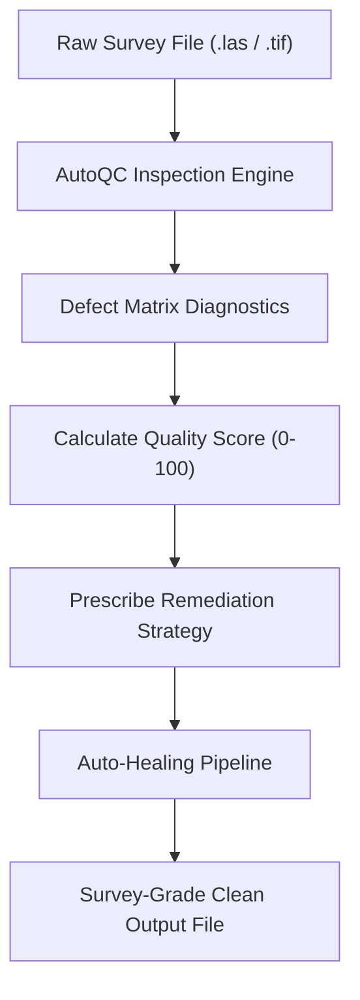

# AutoQC: Survey Diagnostics & Auto-Healing

The **AutoQC** engine (`dronegeo.autoqc`) serves as an automated quality inspector and healing pipeline for raw UAV surveys. It detects defects, explains why they occurred in plain language, quantifies the downstream GIS impact, suggests optimal processing parameters, and auto-heals the files in one step.

---

## 1. What It Does

When drones capture LiDAR and photogrammetry data, common field issues arise that corrupt downstream deliverables:
1. **Sensor Multipath Noise**: Optical reflections off water ponds, glass solar panels, or dust in the air create "floating" laser points 100m above the ground.
2. **Missing Spatial Projection (CRS)**: Flight control software often exports raw Cartesian $X, Y, Z$ coordinates without appending the EPSG coordinate system header (e.g. UTM Zone 32N / EPSG 32632).
3. **NoData Voids**: Water bodies or deep tree shadows produce holes in elevation rasters that break drainage and volume calculations.
4. **Sharp Sensor Tears**: High-speed drone banking can cause vertical cliff tears across adjacent pixels.

AutoQC acts as an automated flight inspector that spots these errors before you spend hours generating corrupt DTMs or volume calculations.

---

## 2. How It Works



### Comprehensive Defect Detection Matrix

| Issue Code | Defect Title | Severity | Physical Root Cause | Downstream GIS Risk | Prescribed Fix |
| :--- | :--- | :--- | :--- | :--- | :--- |
| `LAS_CRS_MISSING` | Missing EPSG Header | **CRITICAL** | Drone exported local Cartesian coordinates | Fails spatial overlay with other project layers | Injects target EPSG CRS projection header |
| `LAS_MULTIPATH_NOISE` | Outlier Elevation Floaters | **CRITICAL / WARNING** | Laser pulse scattering off dust, birds, water | Creates giant artificial spikes in DSMs | Statistical Outlier Removal (SOR) filtering |
| `LAS_UNCLASSIFIED` | Zero Ground Points | **CRITICAL** | Raw photogrammetric cloud without classification | DTM will mistakenly include trees & buildings | Morphological ground segmentation |
| `LAS_LOW_GROUND_DENSITY` | Sparse Ground Returns | **WARNING** | Dense jungle canopy absorbing laser pulses | Creates jagged interpolation voids | Increases $k$-NN search radius ($k=14$) |
| `DEM_VOID_POCKETS` | NoData Hole Clusters | **CRITICAL / WARNING** | Occlusions, shadows, or water absorption | Breaks hydrological flow paths | Smooth distance-transform nearest-neighbor infill |
| `DEM_ELEVATION_SPIKES` | Vertical Cliff Tears ($>15\text{m}$) | **WARNING** | Propeller wash, crane jibs, or bird strikes | Distorts hillshade visual relief | Adaptive local median despike filter |

---

## 3. The Code

```python
import dronegeo as dg

# ---------------------------------------------------------
# Step 1: Inspect Raw Point Cloud Survey
# ---------------------------------------------------------
report = dg.autoqc.inspect_point_cloud("flight_raw.las", expected_crs=32632)

# Print a formatted diagnostic table to the console
report.print_summary()

# Check survey health score (0 - 100)
print(f"Survey Grade Score: {report.quality_score}/100")
print(f"Status: {report.overall_status.value}")

# ---------------------------------------------------------
# Step 2: 1-Line Automated Remediation
# ---------------------------------------------------------
if report.has_critical_issues:
    clean_las = dg.autoqc.remediate_point_cloud(
        las_path="flight_raw.las",
        output_las="flight_repaired.las",
        report=report,
        assign_crs=32632,
        clean_outliers=True
    )
    print(f"Repaired survey written to: {clean_las}")

# ---------------------------------------------------------
# Step 3: Inspect & Repair Elevation Rasters (GeoTIFF)
# ---------------------------------------------------------
dem_report = dg.autoqc.inspect_elevation_model("broken_dem.tif")
if dem_report.has_critical_issues:
    clean_dem = dg.autoqc.remediate_elevation_model(
        dem_path="broken_dem.tif",
        output_dem="healed_dem.tif",
        fill_voids=True,
        despike_filter=True
    )
    print(f"Healed elevation raster: {clean_dem}")
```
