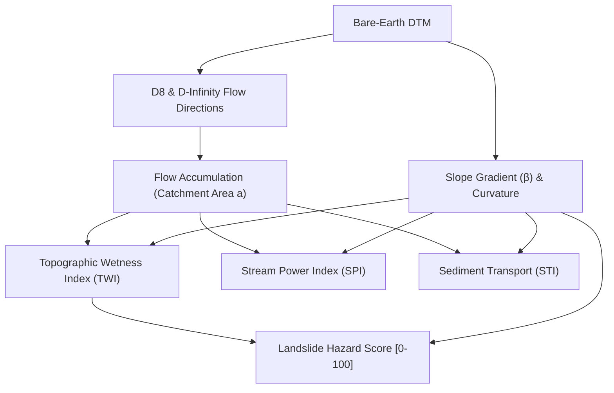

# Hydrology & Flood Risk Modeling

Simulate watershed drainage paths, stream channel formation, soil moisture saturation, and landslide susceptibility from high-resolution drone elevation models.

---

## 1. What It Does

Rainfall runoff dictates environmental risk across construction sites, agricultural fields, and transport corridors. The `dronegeo.hydrology` module models:
- **Drainage Swales & Streams**: Pinpointing where water concentrates and flows during storm events.
- **Flood Pooling & Soil Saturation (TWI)**: Identifying low-lying valley depressions prone to flash flooding and waterlogging.
- **Gully Channel Scouring (SPI)**: Pinpointing locations where high flow velocity causes destructive soil erosion.
- **Hillslope Sediment Transport (STI)**: Quantifying soil loss for erosion control and silt fencing planning.
- **Landslide Susceptibility Hazard**: Classifying slopes at risk of structural geotechnical failure.

---

## 2. How It Works



### Scientific Indices & Formulas

| Index | Formula | What It Means in Plain English | Primary Application |
| :--- | :--- | :--- | :--- |
| **D8 Flow Direction** | Steepest descent to 8 neighbors | Determines which adjacent pixel water flows to. | Watershed delineation & drainage paths |
| **D-Infinity Flow ($D_\infty$)** | Continuous triangular facets ($0-2\pi$) | Allows water to disperse across two downward slope facets. | Diffuse runoff & soil erosion modeling |
| **Flow Accumulation** | Cumulative upslope pixel count | Measures total drainage area feeding into each pixel. | Stream channel & valley extraction |
| **Topographic Wetness Index (TWI)** | $\ln(a / \tan \beta)$ | High TWI indicates flat valley depressions where water ponds. | Flood risk & wetland mapping |
| **Stream Power Index (SPI)** | $a \cdot \tan \beta$ | Measures erosive power of flowing surface runoff. | Culvert placement & gully erosion risk |
| **Sediment Transport Index (STI)** | $(a / 22.13)^{0.6} \cdot (\sin \beta / 0.0896)^{1.3}$ | Evaluates hillslope soil carrying capacity (USLE LS 3D factor). | Agricultural soil conservation & silt fencing |
| **Landslide Hazard Score** | Multi-criteria normalized [0-100] | Flags steep slopes with high wetness and convergent curvature. | Slope failure & landslide hazard zonation |

---

## 3. The Code

```python
import dronegeo as dg

# ---------------------------------------------------------
# Step 1: Flow Directions (D8 & D-Infinity)
# ---------------------------------------------------------
# D8 Deterministic flow direction
d8_tif = dg.hydrology.compute_d8_flow_direction(
    dem_path="bare_earth_dtm.tif",
    output_tif="flow_direction_d8.tif"
)

# D-Infinity continuous flow routing
dinf_tif = dg.hydrology.compute_dinfinity_flow_direction(
    dem_path="bare_earth_dtm.tif",
    output_tif="flow_direction_dinf.tif"
)

# ---------------------------------------------------------
# Step 2: Flow Accumulation & Stream Channels
# ---------------------------------------------------------
accum_tif = dg.hydrology.compute_flow_accumulation(
    dem_path="bare_earth_dtm.tif",
    output_tif="flow_accumulation.tif",
    units="cells"
)

# Extract stream channels exceeding 200 upstream contributing cells
streams_tif = dg.hydrology.extract_stream_network(
    accum_path=accum_tif,
    output_tif="stream_channels.tif",
    threshold_cells=200
)

# ---------------------------------------------------------
# Step 3: Environmental & Engineering Risk Indices
# ---------------------------------------------------------
# Topographic Wetness Index (TWI - Flood Pooling)
twi_tif = dg.hydrology.compute_topographic_wetness_index(
    dem_path="bare_earth_dtm.tif",
    output_tif="twi_flood_risk.tif"
)

# Stream Power Index (SPI - Gully Scouring)
spi_tif = dg.hydrology.compute_stream_power_index(
    dem_path="bare_earth_dtm.tif",
    output_tif="spi_scouring.tif"
)

# Sediment Transport Index (STI - USLE LS Factor)
sti_tif = dg.hydrology.compute_sediment_transport_index(
    dem_path="bare_earth_dtm.tif",
    output_tif="sti_sediment.tif"
)

# Multi-Criteria Landslide Hazard Susceptibility Score [0 - 100]
landslide_tif = dg.hydrology.compute_landslide_susceptibility_index(
    dem_path="bare_earth_dtm.tif",
    output_tif="landslide_hazard_score.tif"
)

print("Hydrological modeling suite executed successfully!")
```
