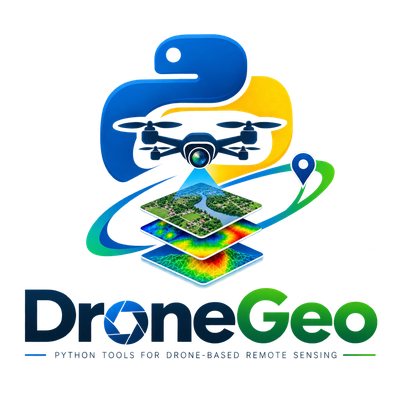
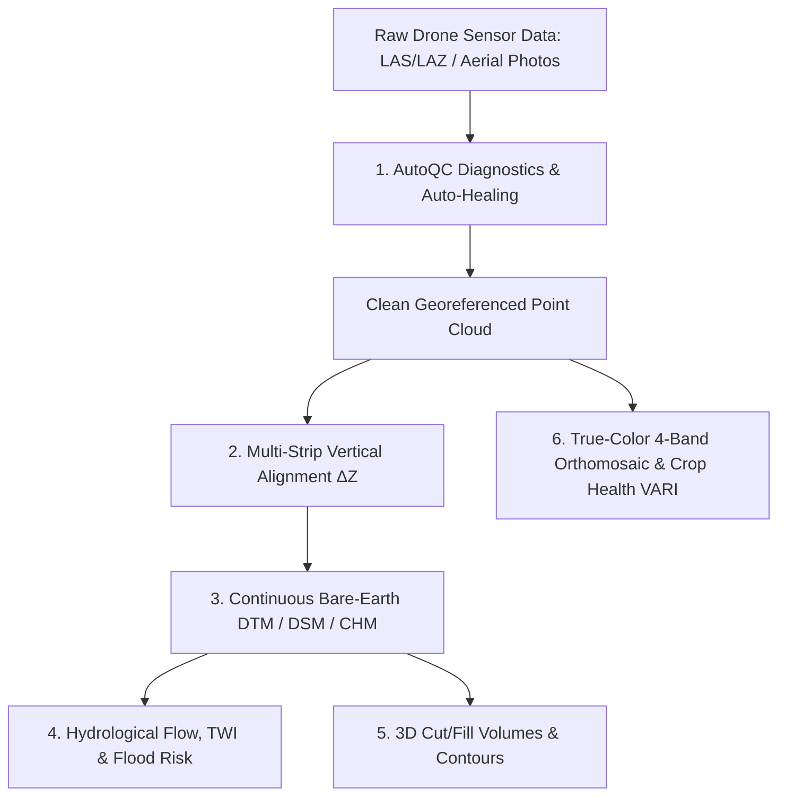

# Welcome to `dronegeo`

<div align="center">
  
  <p><b>High-Performance Python Remote Sensing, UAV LiDAR, Hydrological Flow & Photogrammetry Processing Toolkit</b></p>
</div>

---

## What is `dronegeo`?

When flying drones for surveying, agriculture, environmental engineering, or mining, raw sensor data (LiDAR point clouds and drone camera photos) is rarely ready for downstream GIS analysis:
- Point clouds often have **missing coordinate reference systems (CRS)** or **atmospheric laser reflections (floaters)**.
- Flight passes may have **vertical elevation offsets ($\Delta Z$)** causing artificial steps in the ground surface.
- Naive surface interpolation algorithms (like Delaunay TINs) produce **unnatural triangular facets** and false elevation cliffs.
- Analyzing rainwater drainage, flood pooling, or cut/fill excavation volumes requires complex GIS software with steep learning curves.

**`dronegeo` solves all of these challenges with a clean, high-performance Python API.**

---

## Key Capabilities at a Glance



---

## How It Helps Surveyors and Data Scientists

| Feature Area | What It Solves | Beginner Analogy |
| :--- | :--- | :--- |
| **AutoQC & Diagnostics** | Identifies missing coordinate headers, laser noise floaters, and holes in terrain models, then auto-heals them with 1 function call. | Like an automated "pre-flight health check" and "auto-doctor" for your drone data. |
| **Continuous Surface Models** | Creates ultra-smooth bare-earth DTMs and canopy DSMs using spatial Kd-Tree $k$-NN Inverse Distance Weighting. | Like draping a flexible blanket over the ground to capture smooth hills without jagged facet spikes. |
| **Hydrology & Flood Risk** | Simulates where rainwater flows across every pixel, finds natural stream valleys, and scores flood pooling / landslide risks. | Like dropping virtual water drops across the terrain to see where streams and flash flood pools form. |
| **True-Color Orthos & Crop Vitality** | Generates 4-band RGBA photographic maps and agricultural crop greenness indices (VARI, GLI, TGI, ExG). | Like turning billions of 3D laser points into a crystal-clear satellite-style map with crop health heatmaps. |
| **3D Volumetrics & Contours** | Measures exact cubic meters ($m^3$) of excavated earth and deposited soil between two survey flights. | Like calculating how many dump trucks of dirt were removed from a construction site or quarry. |

---

## Installation in Seconds

Install the official release from PyPI:

```bash
pip install dronegeo
```

To install all optional extras (documentation tools, tests, CLI):

```bash
pip install "dronegeo[docs,test,dev]"
```
