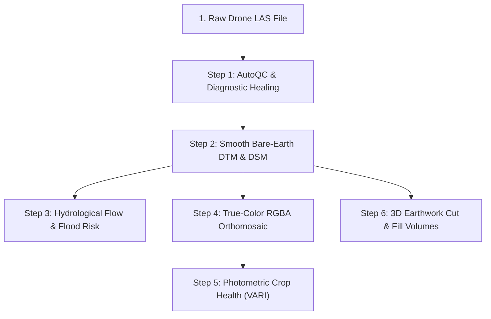

# Beginner Quickstart Tutorial

A complete walkthrough designed for newcomers, drone pilots, and GIS engineers. Learn how to transform raw aerial survey data into professional GIS deliverables in under 5 minutes.

---

## Tutorial Workflow Overview



---

## Step 1: Pre-Processing AutoQC & 1-Line Healing

### 1. What It Does
When a drone lands after a survey flight, the raw point cloud (`.las` or `.laz`) often contains hidden errors:
- Missing spatial projection headers (no EPSG code), causing files to open in the wrong location in QGIS/ArcGIS.
- Atmospheric laser dust / bird floaters high above the ground ($+100\text{m}$).
- Low point density or unclassified ground points.

AutoQC audits your raw survey in milliseconds and automatically heals detected errors in one simple function call.

### 2. How It Works
1. **Header & Metadata Scan**: AutoQC reads the LAS header, bounding box, and variable length records (VLRs) to verify the Coordinate Reference System (CRS).
2. **Statistical Density & Class Binning**: Calculates points per square meter ($pts/m^2$) and verifies whether ground returns (ASPRS Class 2) are present.
3. **Statistical Outlier Removal (SOR)**: Identifies noise floaters using spatial deviation thresholds and strips them safely without losing real terrain points.
4. **Auto-Healing**: Exports a repaired, clean LAS file with embedded CRS projection and zero noise artifacts.

### 3. The Code
```python
import dronegeo as dg

# 1. Audit raw LAS file
report = dg.autoqc.inspect_point_cloud("flight_raw.las", expected_crs=32632)

# Print a human-readable diagnostic report to the terminal
report.print_summary()

# 2. If errors were found (e.g. laser noise floaters or missing CRS), auto-heal:
if report.has_critical_issues:
    clean_las = dg.autoqc.remediate_point_cloud(
        las_path="flight_raw.las",
        output_las="flight_cleaned.las",
        report=report,
        assign_crs=32632,
        clean_outliers=True
    )
    print(f"Repaired survey written to: {clean_las}")
else:
    clean_las = "flight_raw.las"
```

---

## Step 2: Create Bare-Earth DTM, DSM & Canopy Heights

### 1. What It Does
- **Digital Terrain Model (DTM)**: Strips away trees, crops, cars, and buildings to create a smooth, continuous bare ground surface.
- **Digital Surface Model (DSM)**: Captures the highest pulse returns, including tree canopies, rooftops, and powerlines.
- **Canopy Height Model (CHM)**: Subtracts the ground from the surface ($\text{DSM} - \text{DTM}$) to measure the exact height of every tree and crop in meters.

### 2. How It Works
1. **Ground Point Filtering**: Extracts only ASPRS Class 2 (Ground) laser returns.
2. **Kd-Tree Spatial $k$-NN Inverse Distance Weighting (IDW)**: Computes local ground elevations across a continuous grid without leaving facet stepping artifacts.
3. **GeoTIFF Rasterization**: Outputs 32-bit floating point single-band GeoTIFFs with embedded affine spatial geotransforms.

### 3. The Code
```python
import dronegeo as dg

# 1. Generate Bare-Earth DTM (0.25m / 25cm pixel resolution)
dtm_tif = dg.dem.create_dtm(
    las_path="flight_cleaned.las",
    output_tif="terrain_dtm.tif",
    resolution=0.25,      # Ground Sampling Distance in meters
    k_neighbors=8         # Number of neighboring ground points to interpolate
)

# 2. Generate Digital Surface Model (DSM)
dsm_tif = dg.dem.create_dsm(
    las_path="flight_cleaned.las",
    output_tif="surface_dsm.tif",
    resolution=0.25
)

# 3. Compute Canopy Height Model (CHM = DSM - DTM)
chm_tif = dg.dem.create_chm(
    dsm_path=dsm_tif,
    dtm_path=dtm_tif,
    output_tif="canopy_heights.tif",
    clamp_min=0.0         # Clamps any small negative sensor noise to 0.0m
)
print("Surface models successfully generated!")
```

---

## Step 3: Hydrological Flow Routing & Flood Risk Modeling

### 1. What It Does
Simulates rainwater runoff across the landscape to answer critical engineering questions:
- Where does water drain and concentrate into gullies?
- Which low-lying depressions will become waterlogged or flooded?
- Which steep slopes are vulnerable to landslide failure?

### 2. How It Works
1. **D8 Steepest Descent**: Calculates the direction of steepest elevation drop from each pixel to one of its 8 neighbors.
2. **Flow Accumulation**: Counts how many upslope cells drain through every pixel.
3. **Topographic Wetness Index (TWI)**: Combines upslope catchment area ($a$) with local slope angle ($\beta$):
   $$\text{TWI} = \ln\left(\frac{a}{\tan \beta}\right)$$
4. **Landslide Hazard Scoring**: Computes a multi-criteria stability index from 0 (safe) to 100 (extreme danger).

### 3. The Code
```python
import dronegeo as dg

# 1. Compute D8 Water Flow Direction
d8_tif = dg.hydrology.compute_d8_flow_direction(
    dem_path="terrain_dtm.tif",
    output_tif="flow_direction_d8.tif"
)

# 2. Compute Flow Accumulation (Drainage Networks)
accum_tif = dg.hydrology.compute_flow_accumulation(
    dem_path="terrain_dtm.tif",
    output_tif="flow_accumulation.tif",
    units="cells"
)

# 3. Compute Topographic Wetness Index (TWI - Flood Pooling Risk)
twi_tif = dg.hydrology.compute_topographic_wetness_index(
    dem_path="terrain_dtm.tif",
    output_tif="twi_flood_risk.tif"
)

# 4. Compute Landslide Hazard Susceptibility Score [0 - 100]
landslide_tif = dg.hydrology.compute_landslide_susceptibility_index(
    dem_path="terrain_dtm.tif",
    output_tif="landslide_hazard.tif"
)
```

---

## Step 4: True-Color 4-Band RGBA Orthomosaics

### 1. What It Does
Produces a high-resolution, photographic aerial map from colorized point clouds. Includes a transparent 4th Alpha band that cleanly cuts out nodata background areas for clean presentation in GIS layouts.

### 2. How It Works
1. **Point Color Extraction**: Samples red, green, and blue pulse values recorded by the aerial camera.
2. **Spatial Gridding & Alpha Masking**: Grids color channels and generates an 8-bit Alpha channel where valid survey points exist.
3. **Percentile Contrast Stretch**: Applies 2%-98% cumulative histogram normalization to enhance contrast under hazy or low-light flight conditions.

### 3. The Code
```python
import dronegeo as dg

# Generate 4-band RGBA True-Color Orthomosaic (10cm GSD)
ortho_path = dg.imagery.create_true_color_orthomosaic(
    las_path="flight_cleaned.las",
    output_tif="true_color_orthomosaic.tif",
    resolution=0.10,      # 10cm ground resolution
    alpha_channel=True,   # Transparent boundary mask
    auto_contrast=True    # Dynamic histogram stretch
)
print(f"Orthomosaic created: {ortho_path}")
```

---

## Step 5: Photometric Crop Health & Vegetation Indices

### 1. What It Does
Monitors crop health, nitrogen stress, and chlorophyll density from standard consumer drone RGB cameras (e.g. DJI Mavic 3 Enterprise, Phantom 4 Pro) without needing expensive multispectral NIR hardware.

### 2. How It Works
- **Visible Atmospherically Resistant Index (VARI)**: Cancels out atmospheric haze and lighting variations:
  $$\text{VARI} = \frac{G - R}{G + R - B}$$
- **Green Leaf Index (GLI)**: Evaluates canopy leaf chlorophyll:
  $$\text{GLI} = \frac{2G - R - B}{2G + R + B}$$

### 3. The Code
```python
import dronegeo as dg

# 1. Compute VARI Crop Greenness Map
vari_tif = dg.imagery.compute_vari(
    ortho_path="true_color_orthomosaic.tif",
    output_tif="crop_health_vari.tif"
)

# 2. Compute GLI Chlorophyll Index
gli_tif = dg.imagery.compute_gli(
    ortho_path="true_color_orthomosaic.tif",
    output_tif="leaf_chlorophyll_gli.tif"
)
print("Vegetation health maps generated!")
```

---

## Step 6: 3D Earthwork Cut & Fill Volumetrics

### 1. What It Does
Calculates exact excavated material volume ($m^3$) and fill volume ($m^3$) between two drone survey flights (e.g., Month 1 vs Month 2 in a quarry or construction site).

### 2. How It Works
1. **Pixel-by-Pixel Elevation Differencing**: Computes $\Delta Z = Z_{\text{after}} - Z_{\text{before}}$ for every grid cell.
2. **Volumetric Integration**: Multiplies positive height changes ($\Delta Z > 0$) by pixel area ($A = \text{res}^2$) to calculate Fill Volume, and negative height changes ($\Delta Z < 0$) to calculate Cut Volume.

### 3. The Code
```python
import dronegeo as dg

# Compute 3D cut & fill volumes between two epochs
report = dg.analysis.compute_cut_fill_volume(
    before_dem="quarry_epoch1_dtm.tif",
    after_dem="quarry_epoch2_dtm.tif",
    output_diff_tif="elevation_difference_map.tif"
)

print(f"Excavated Cut Volume: {report.cut_volume_m3:,.2f} m³")
print(f"Deposited Fill Volume: {report.fill_volume_m3:,.2f} m³")
print(f"Net Mass Balance: {report.net_volume_m3:,.2f} m³")
print(f"Average Elevation Shift: {report.mean_elevation_change_m:+.3f} m")
```
