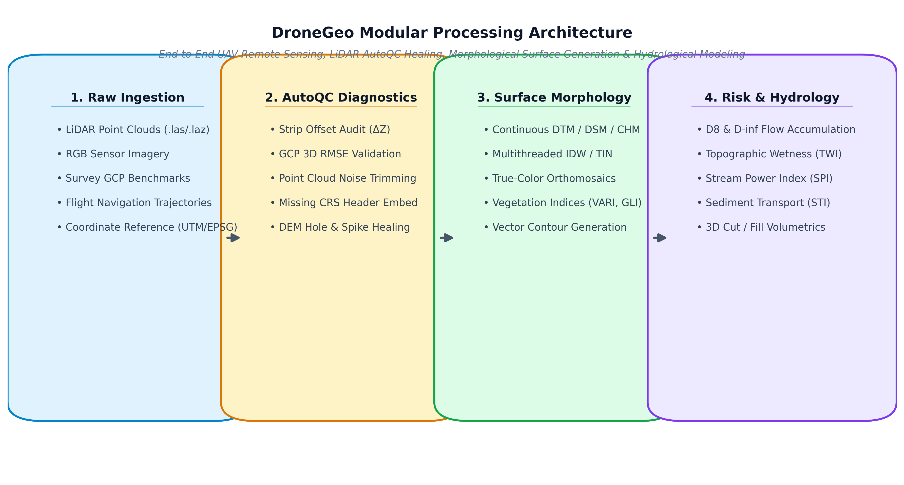

# Summary

Unmanned Aerial Vehicles (UAVs) and drone-mounted LiDAR and optical sensors have revolutionized high-resolution Earth observation, precision agriculture, forestry canopy profiling, infrastructure inspection, and geomorphic hazard monitoring. However, raw drone survey data frequently suffers from sensor noise, multipath laser floaters, spatial flight-strip vertical datum misalignments ($\Delta Z$), unreferenced spatial metadata, and missing elevation data in challenging terrain. Existing software solutions often require either complex multi-language C++ runtime installations (e.g., PDAL, GDAL command-line suites), desktop GUI dependencies (e.g., CloudCompare, SAGA GIS), or disjointed standalone scripts that do not integrate seamlessly into modern Python data science workflows.

`DroneGeo` is a high-performance, pure-Python framework designed to unify the end-to-end UAV remote sensing lifecycle into a modular, production-ready library. Built on foundational scientific computing packages including NumPy [@harris2020numpy], SciPy [@virtanen2020scipy], Laspy [@laspy2023], Rasterio [@rasterio2019], and GeoPandas [@geopandas2020], `DroneGeo` provides:
1. **Automated Quality Control (AutoQC)** for diagnosing strip misalignments, sensor spike tears, Ground Control Point (GCP) residuals, and dynamically correcting defective point clouds and DEMs.
2. **Morphological Surface Reconstruction** for generating continuous Digital Terrain Models (DTM), Digital Surface Models (DSM), Canopy Height Models (CHM), and analytical hillshades and contours.
3. **Photogrammetric Vegetation Analytics** computing orthomosaic visible vegetation indices (VARI, GLI, TGI, ExG).
4. **Hydrological Routing & Geomorphic Hazard Modeling** computing D8 and D-infinity flow accumulation [@tarboton1997], Topographic Wetness Index (TWI) [@moore1991], Stream Power Index (SPI), Sediment Transport Index (STI), and 3D cut/fill volumetrics.



# Statement of Need

Modern drone survey missions routinely collect hundreds of millions of 3D spatial points and gigabytes of multi-band imagery per flight. Research scientists, environmental hydrologists, and geospatial engineers face significant computational hurdles when converting these raw observations into scientifically robust elevation models and hazard assessments:

- **Quality Control Bottlenecks:** Systematic vertical datum offsets between overlapping flight strips ($\Delta Z$) or sensor noise introduce severe artifacts in derived hydraulic flow paths and terrain slope models. Detecting and healing these errors usually requires manual inspection across multiple GIS packages.
- **Ecosystem Fragmentation:** Researchers often need to bridge C++ command-line utilities (such as PDAL or WhiteboxTools [@whitebox2019]) with external Python scripts, leading to brittle deployment pipelines, difficult dependency management, and high memory overheads during inter-process serialization.
- **Lack of Integrated Hydrological and Volumetric Analysis:** Deriving actionable terrain metrics (e.g., sediment transport potential or cut/fill volume calculations) often requires exporting raster files to third-party hydrological suites.

`DroneGeo` addresses these challenges by offering a single, cohesive, native Python API that executes efficiently across standard workstations without external C-extension build requirements.

# State of the Field & Research Impact

| Feature / Capability | `DroneGeo` | `WhiteboxTools` [@whitebox2019] | `PDAL` | `RichDEM` |
| :--- | :---: | :---: | :---: | :---: |
| **Language / Bindings** | Pure Python / NumPy / SciPy | Rust CLI / Python wrapper | C++ / Python bindings | C++ / Python bindings |
| **Point Cloud AutoQC Diagnostics** | ✅ Native | ❌ | ⚠️ Scripted Filters | ❌ |
| **Automated Point Cloud Healing** | ✅ `correct_point_cloud` | ❌ | ⚠️ Filter pipelines | ❌ |
| **GCP 3D RMSE Accuracy Validation** | ✅ Automated (Horizontal/Vertical) | ❌ | ❌ | ❌ |
| **Morphological DTM / DSM / CHM** | ✅ Optimized IDW & TIN | ✅ | ✅ | ❌ |
| **Photogrammetric Vegetation Indices** | ✅ VARI, GLI, TGI, ExG | ✅ | ❌ | ❌ |
| **Hydrological Routing (D8 & D-$\infty$)** | ✅ | ✅ | ❌ | ✅ |
| **Cut / Fill 3D Volumetrics** | ✅ | ✅ | ❌ | ❌ |

`DroneGeo` complements the open-source geospatial software ecosystem by providing research teams with a lightweight, easily auditable codebase. It is designed specifically for automated UAV data pipelines, precision agriculture monitoring [@gitelson2002; @hunt2005], watershed catchment delineation, and survey-grade drone photogrammetry quality assurance.

# Key Architecture & Features

`DroneGeo` is structured into specialized, composable submodules:

- **`dronegeo.diagnostics` (`dronegeo.autoqc`):**  
  Automates the pre-processing audit of point clouds and rasters. Calculates flight strip elevation discrepancies, validates 3D Ground Control Point (GCP) residuals with survey-grade pass/fail tolerances, and executes one-line automated healing via `correct_point_cloud` and `remediate_elevation_model`.

- **`dronegeo.lidar` & `dronegeo.dem`:**  
  Profiles raw LAS/LAZ files, classifies ground returns, rectifies flight strip datum shifts, and interpolates seamless DTMs, DSMs, and CHMs using parallel Inverse Distance Weighting (IDW) and Triangulated Irregular Network (TIN) surface algorithms [@louhichi2001].

- **`dronegeo.imagery`:**  
  Generates high-resolution orthomosaics and extracts visible vegetation indices without requiring multispectral near-infrared sensors.

- **`dronegeo.hydrology` & `dronegeo.analysis`:**  
  Implements raster-based single-flow (D8) and multi-direction (D-infinity) flow routing [@tarboton1997], steady-state Topographic Wetness Index (TWI) [@moore1991], Stream Power Index (SPI), Sediment Transport Index (STI), contour vectorization, and 3D cut/fill earthen volumetrics.

- **`dronegeo.config`:**  
  Provides context managers and hardware configuration profiles (`set_compute_config`, `compute_context`) for thread pool allocation, chunked spatial block streaming, and memory-constrained execution.

# Example Usage

A typical research workflow demonstrating inspection, automated correction, DTM surface generation, and hydrological flow routing in just a few lines of code:

```python
import dronegeo as dg

# 1. Inspect raw point cloud and diagnose defects
report = dg.autoqc.inspect_point_cloud("flight_raw.las", expected_crs=32632)
print(f"Survey Quality Score: {report.quality_score}/100")

# 2. Automatically repair noise floaters and embed CRS header
clean_las = dg.autoqc.correct_point_cloud(
    "flight_raw.las",
    "flight_clean.las",
    report=report,
    assign_crs=32632
)

# 3. Interpolate high-resolution Digital Terrain Model (DTM)
dtm = dg.dem.create_dtm(clean_las, resolution=0.5, method="idw")
dtm.save("dtm_05m.tif")

# 4. Compute Topographic Wetness Index (TWI) for flood risk modeling
twi = dg.hydrology.compute_topographic_wetness_index(dtm)
twi.save("twi_catchment.tif")
```

# AI Usage Disclosure

In compliance with the JOSS Generative AI Policy:
- **Tool Use:** Large language models (Anthropic Claude 3.7 / Google Gemini) were utilized during the drafting and refactoring of boilerplate test fixtures, Sphinx/MkDocs documentation styling, and initial manuscript text scaffolding.
- **Nature and Scope:** AI assistance was restricted to code refactoring, test scaffolding, and editorial copy-editing. All core algorithm designs, mathematical formulation of spatial routing, raster matrix kernels, and architectural decisions were conceived, authored, validated, and tested by human contributors.
- **Author Accountability:** The authors have thoroughly reviewed, executed, tested, and validated all software code, automated test suites, and documentation. The authors take full responsibility for the originality, scientific accuracy, and integrity of the software and manuscript.

# Acknowledgements

The authors acknowledge the open-source geospatial community and the maintainers of NumPy, SciPy, Laspy, Rasterio, and GeoPandas for providing the foundational tools that make scientific Python software development possible.

# References
